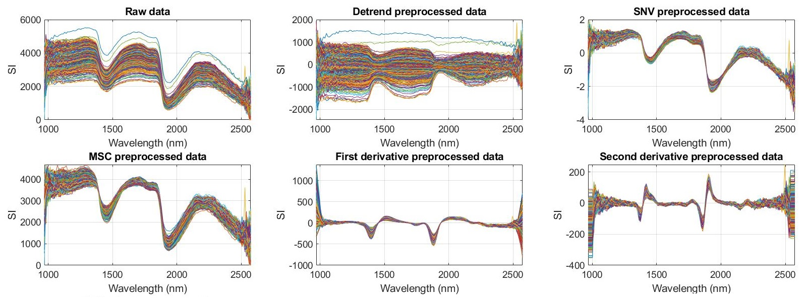

# Matlab Toolbox for the creation of a PLSR model

If you use this toolbox, we would appreciate a reference to one of the following papers

```markdown
Jacq, K., Perrette, Y., et al. (2019) High-resolution prediction of organic matter concentration with hyperspectral imaging on a sediment core. Science of the Total Environment 663: 236–244

Jacq, K., Giguet-Covex, C., et al. (2019) High-resolution grain size distribution of sediment core with hyperspectral imaging. Sedimentary Geology 393–394:
```

# Worflow


## Raw data

Two types of data are mandatory to use this toolbox. First, a hyperspectral image (M) and some information, depth (dm), and wavelength (wl). Secondly, the variable(s) to predict (Y), that can be a vector or a matrix, its sampling depth vector (dy), and the label (Yn).

## Reflectance or pseudo-absorbance
Generally, the hyperspectral image unity is reflectance (R). According to Beer-Lambert law, the chemical concentration of a compound is related to the absorbance (A). Thus, the hyperspectral image can be converted into pseudo-absorbance with the formula: A=log(1/R).

## Depth calibration
The two depth vectors are then compared to find the hyperspectral pixels related to a sampling area.

## Spectral preprocessing


In this toolbox, four main preprocessing are used, also nine combinations of them. Thus, thirteen preprocessing and the raw data are compared to find an optimal one. They allow to reduce noise and highlight relevant spectral information to predict the interest variable(s).

Detrending is used to remove the baseline. Multiplicative Scatter Correction (MSC) and Standard Normal Variate (SNV) are used to correct the spectra from light scattering. The Savitzky–Golay filter is used to derivate the spectra and to reduce additive effects (baseline offset and slope).

```markdown
Vidal, M., Amigo, J.M. (2012) Pre-processing of hyperspectral images. Essential steps before image analysis. Chemometrics and Intelligent Laboratory Systems 117: 138–148

Rinnan, Å., Berg, F. van den, Engelsen, S.B. (2009) Review of the most common preprocessing techniques for near-infrared spectra. TrAC Trends in Analytical Chemistry 28: 1201–1222

Barnes, R.J., Dhanoa, M.S., Lister, S.J. (1989) Standard Normal Variate Transformation and De-Trending of Near-Infrared Diffuse Reflectance Spectra. Applied Spectroscopy 43: 772–777

Savitzky, A., Golay, M.J.E. (1964) Smoothing and Differentiation of Data by Simplified Least Squares Procedures. Analytical Chemistry 36: 1627–1639
```

## Normalization
Second spectral processing can be used to normalized the signal base on the mean and standard deviation of the hyperspectral image. Thus, centering or autoscaling can be chosen by the user.

## Subsampling
In order to combine each sampling value to one spectrum, subsampling must be made. Several approaches can be used:
*  Sample main chemical compounds (organic matter, particle size):
	* The most simpler to understand is to select a median or averaged spectrum of the sampling areas. We recommend to use these approaches for a discontinuous distribution of the interest variable. Thus, one learning spectral set is created. 
To increase spectral variations, the image can be divided along the depth to create multiple images, and thus increase the selected learning spectra. It can be made if the lateral variations of the sample are negligible.
	* Random selection can be used in the case of a normal distribution to find optimal spectra related to the interest value. In this case, several learning spectral sets are created, and the optimal one was selected based on the model performances.
*  Sample minor chemical compounds (coal, particles):
	* To find these localized pixels, a most advanced study of the distribution must be made. If the spectra are associated with extreme, minima, and maxima spectrum is selected. Otherwise, Kennard and Stone can be used to find the most different spectra in the sampling area. Thus, one or several learning spectral set(s) is/are estimated.

```markdown
Kennard, R.W., Stone, L.A. (1969) Computer Aided Design of Experiments. Technometrics 11: 137–148
```

## Optimal preprocessing
Based on the model performances (correlation, standard error, uncertainty), the optimal preprocessing and learning spectral set are selected to estimate the **best PLSR model for the interest variable(s)**.

## Variable selection

Generally, all the wavelengths are not necessary to predict an interest variable. Some can contain redundant information, whereas other are noisy or have not usefull information, thus, they can induced miss-learning or bias. Therefore, it is recommanded to remove them to increase the model performances. Seven variable selection algorithms are implemented base on the two toolboxes cited below: 
* Variable Importance in Projection (VIP)
* Target Projection (TP)
* Uninformative Variable Elimination (UVE)
* Competitive Adaptive Reweighted Sampling (CARS)
* Random Frog (RF)
* Variable Complementary Network (VCN)
* Genetic Algorithm PLS (GA-PLS)

```markdown
Li, H., Xu, Q., Liang, Y. (2014) libPLS: An Integrated Library for Partial Least Squares Regression and Discriminant Analysis. PeerJ PrePrints

Leardi, R., Lupiáñez, A. (1998) Genetic algorithms applied to feature selection in PLS regression: how and when to use them. Chemometrics and Intelligent Laboratory Systems 41: 195–207
```

## Reduce model estimation
